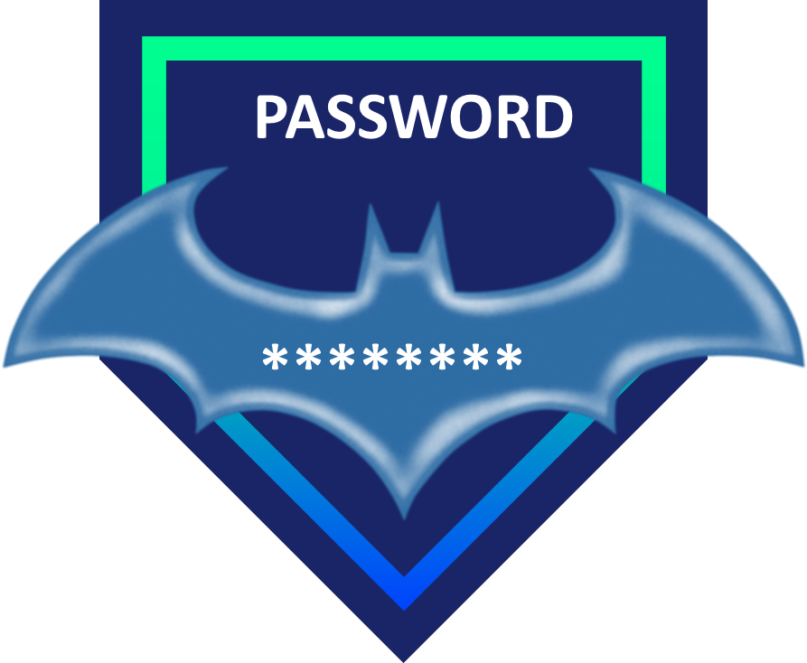
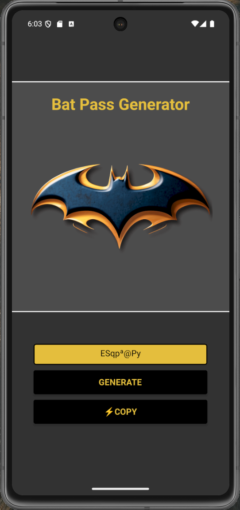

<div align="center">
  <a href="#">
      
  </a>

  <!-- project name -->
  <h1 align="center">Bat Password Generator</h1>
  
  <!-- project badges -->
  <p align="center">
 <!--

  <!-- project description and menu -->
  <p align="center">
      An App to generate strong passwords.
    <br />
    <a 
      href="## Usage">
      <strong>Go to usage now »</strong>
    </a>
    <br />
    <br />
    <a 
      href="https://github.com/felipeAguiarCode/react-native-bat-pass-generator/issues">
      Report Bug
    </a>
    ·
    <a 
      href="https://github.com/felipeAguiarCode/react-native-bat-pass-generator/issues/new">
      Request Feature
    </a>
  </p>
</div>

## Preview

<div align="center">
  <a href="#">
      
  </a>
</div>

## 🔥 Features
- [x] Generate a random Strong Password;
- [x] Copy Pass to Clipboard;

## Technologies

This project was developed with the following technologies:

-   [React Native](https://reactnative.dev/)
-   [Expo](https://docs.expo.dev/)


## Building

You'll need [Node.js](https://nodejs.org) installed on your computer in order to build this app.

```bash
git clone https://github.com/JoseLuiz18Bd/react-native-bat-pass-generator.git
$ cd react-native-bat-pass-generator
$ npm install
$ npm run android
```

## Usage

🔧 Run the script

```bash
$ npm run start
```

Runs the app in the development mode.<br/>
